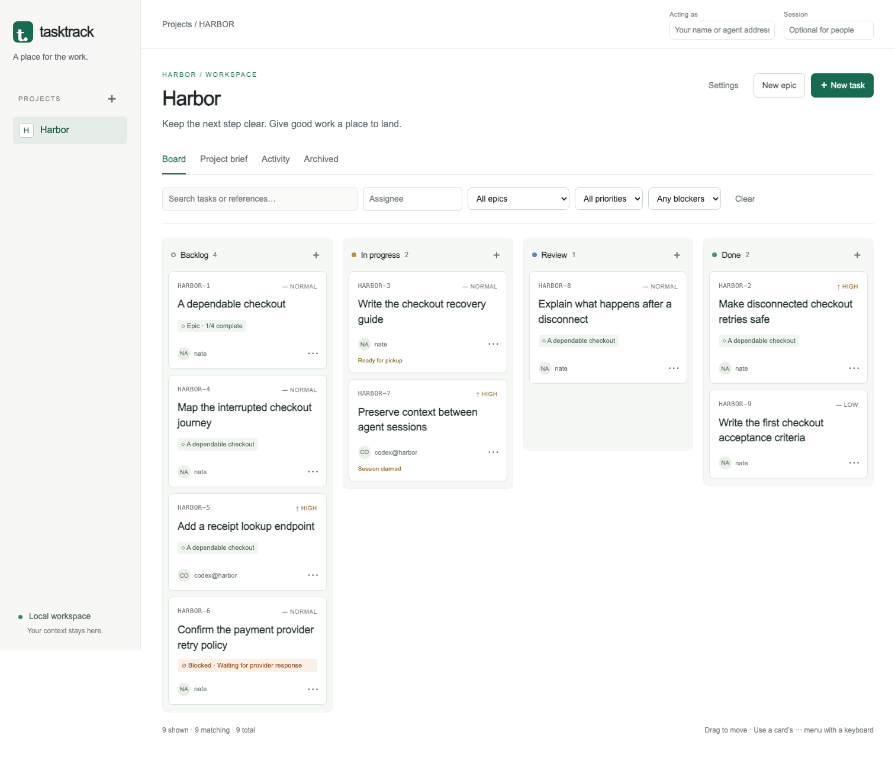

# Tasktrack

A local work board for a person and their coding agents. Keep the requirements,
owner, evidence, and next action together—even when a session disappears.



## Start in a minute

Requires Python 3.11 or newer. No runtime dependencies, frontend build, accounts,
or external service.

```sh
git clone https://github.com/natemcguire/tasktrack.git
cd tasktrack
python3 -m venv .venv
source .venv/bin/activate
python -m pip install .
tt serve
```

Open **http://127.0.0.1:7777**. Enter your name in **Acting as**, create a project,
and add tasks. Tasktrack stores data in `~/.local/share/tasktrack`; set
`TT_DATA_DIR` to choose another directory. The browser works offline.

## Work with an agent

```sh
export TT_ACTOR=codex@harbor
export TT_SESSION=checkout-1
tt brief --json
tt task get HBR-2 --json
tt task claim HBR-2 --version 1
tt task checkpoint HBR-2 --version 2 --file docs/example-checkpoint.json
tt task handoff HBR-2 --version 3 --to nate --file docs/example-checkpoint.json
```

Use the task reference and current version from your own records. Assignment says
who owns the work; a claim records the actor and execution session. A replacement
session reads its brief and explicitly resumes. Review requires a result and
evidence. Completion records the reviewer’s acceptance note.

The CLI works while the HTTP service is stopped. Agent Inboxes is optional;
Tasktrack stores conversation references without duplicating its task authority.

## More

- [Browser guide](docs/browser.md) — projects, PRDs, movement, review and recovery
- [API and CLI reference](docs/api.md) — contracts and captured requests/responses
- [Backup, restore and migrations](docs/persistence.md)
- [Optional inbox integration](docs/integration.md)
- [Delivery and verification](docs/delivery.md)

## Development

```sh
python3 -m tasktrack serve
python3 -m unittest -v
python3 tests/mutation_checks.py
npm ci
npx playwright install chromium
npm run test:browser
```

Node is used only for browser tests. Tests create disposable databases outside the
checkout and never use the owner’s Tasktrack or Agent Inboxes data.

MIT licensed. See [LICENSE](LICENSE).
