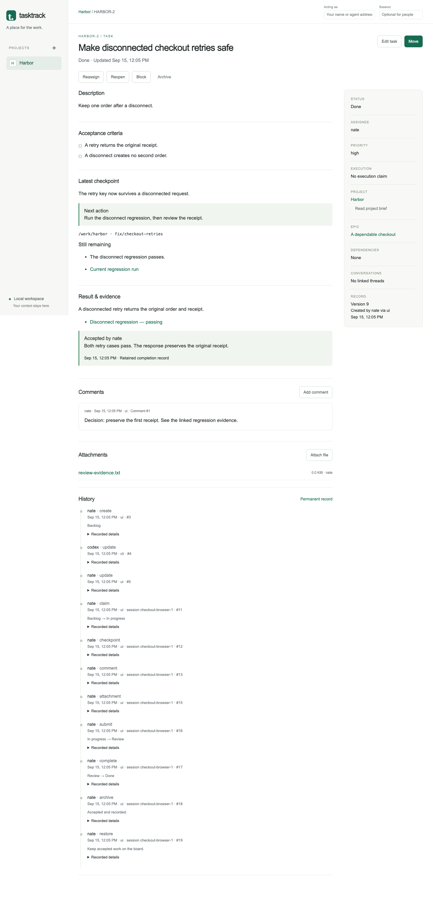
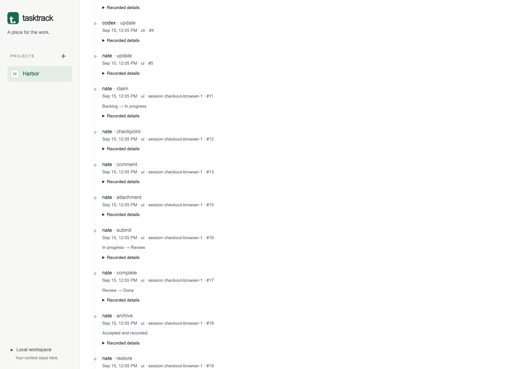

# Working in the browser

## A project gives the work its context

Create a project from the sidebar. Its key is the short reference prefix; its
brief holds the project PRD in Markdown. Add external document links in settings.
The **Project brief** tab shows the full requirements, and **Activity** includes
changes from the browser, CLI and API.

Use **New epic** for a larger requirement and choose that epic when creating its
child tasks. Epic detail shows child progress and links. Epics do not acquire
execution claims, and finishing an epic requires completed children.

Project settings can rename the key and name. Earlier keys remain aliases. Both
`/projects/HBR` and a saved reference such as `HBR-2` continue to resolve after a
rename; a task’s `/tasks/2` URL never changes.

## Shape the board

The four columns are Backlog, In progress, Review and Done. Drag a card to a column
or onto another card. The dialog lets you choose its position and supply any
required context. For a keyboard equivalent, focus the card’s **⋯** button and
press Enter, then choose the column and position.

Search references, titles and descriptions. Combine filters for assignee, epic,
priority and blockers. Counts distinguish shown, matching and total work. Columns
load 20 cards at a time; **Load more** explicitly retrieves the next page. On a
narrow screen, use the column selector above the board.

A backlog draft can be short or incomplete. Starting requires a description,
acceptance criteria, an assignee and resolved blockers. A blocked task stays in
its current column. Completing or archiving a card never implicitly satisfies an
unfinished prerequisite.

## Keep the next action clear

Task detail contains the description, acceptance criteria, parent epic, dependencies,
checkpoint, evidence, comments, files and chronological history. Comments are
append-only. Files are limited to 10 MiB and download as attachments.

Set **Acting as** before saving. Agent workflows also supply a **Session**. These
values record cooperative attribution; they are not user accounts. The browser
remembers them locally. A claim records a timestamp, without inferring whether
that process is still running.

**Checkpoint** saves progress and the next action. Supply the code workspace and
branch or commit; for other work, explain why those fields do not apply.
**Handoff** keeps the task in progress, releases the claim, and optionally changes
its assignee. **Resume** binds an existing claim to a new session of the same actor.
Another actor must explicitly reassign the task with a reason.

## Review and recover

**Submit for review** requires a result summary and at least one evidence link.
It releases the execution claim. **Complete** records an acceptance note and the
reviewing actor. **Request changes** returns work to In progress for another claim.
Earlier evidence stays available when work is reopened.

If an edit conflicts with a newer save, the dialog preserves the unsaved input.
Choose **Review latest version**, compare the saved record with your fields, and
save after reconciling the changes. A network retry keeps its request key; the
server returns the earlier response when the first request already committed.

Archive preserves stable links, attachments and history. The **Archived** view and
task detail expose **Restore**. Claimed work needs a handoff or explicit reassignment
before archive; unfinished work with dependents or an epic relationship must resolve
those relationships first.

