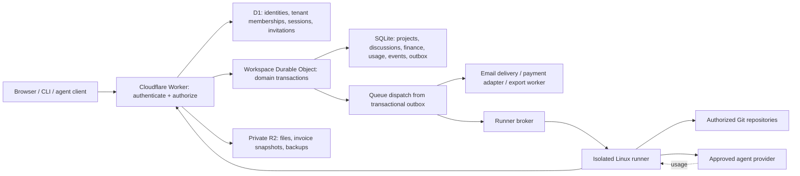
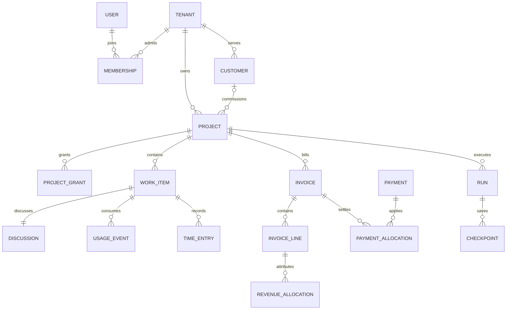

# Architecture

## Decisions

- Keep the existing Python domain service, SQLite persistence and Cloudflare
  Worker. Evolve the present workspace into a tenant; do not add a second company
  concept that duplicates it.
- A user has one login identity and memberships in zero or more tenants. A
  membership says internal/external and role. A customer organization belongs to
  exactly one tenant. Customer organizations never own the tenant.
- Projects default to **all internal members**. A restricted internal project
  uses explicit internal grants. Every external person needs an explicit grant
  to each project, even if their customer organization is assigned to it.
- A project may serve one customer organization in the first release. It can
  have multiple invoices, epics, Comms conversations and Git repositories.
- Internal costs, private notes, agent traces and location evidence are separate
  resources/fields. Public links and customer responses use positive field
  allowlists, never “serialize everything then hide a few fields.”
- Cloudflare hosts the web app, authentication, data, assets, queues and email.
  An isolated Linux runner is optional. Support a private VPS adapter first;
  qualify Cloudflare Sandbox for the same contract. The app works without either.
- Tenant integrations are opt-in. Shared hosting uses tenant-owned Stripe
  connected accounts; self-hosting may configure its own account. Banking is a
  generic optional adapter. QuickBooks Online is the initial accounting target.
- An agency's own implementation details and assets are tenant data. No default
  tenant is privileged, named, seeded or embedded in public builds.

## Runtime map

There is no distributed transaction spanning D1, a Durable Object, R2, Stripe or
email. Store durable intent first, perform external I/O outside a SQLite
transaction, then record the result with idempotency and retry. Each feature PRD
defines how to reconcile a crash between those steps.

## Canonical records and ownership

| Store | Records | Reason |
| --- | --- | --- |
| D1 | users, workspaces, memberships, sessions, invitations, scoped credentials, integration routing IDs | Authenticate and route before entering tenant storage |
| Tenant SQLite | project grants, customers, boards, tasks, epics, Comms, discussions, scope, invoices, receipts, expenses, usage/time, audit/outbox | One tenant's domain state changes atomically |
| R2 private prefixes | attachments, normalized logos, issued PDFs, signed backup manifests, encrypted runner checkpoints | Large immutable artifacts; authorization before download |
| Secret storage | tenant credential envelopes and runner authentication material | Never return cleartext after write; no credentials in jobs or ordinary domain exports |

All SQL foreign keys stay inside one store. A D1 membership ID is validated before
a tenant transaction; it is not a fake cross-database FK. Role changes increment
`membership_revision` and revoke affected sessions/tokens. Worker revalidates
membership on every request. Queued jobs carry actor/membership identifiers and
required capabilities, and recheck them at execution time. They never retain an
old permission snapshot as continuing authority.

Project grants and task-level sharing live in tenant storage and are evaluated
inside the domain operation. A malicious client cannot choose a different Durable
Object by passing a tenant ID. UUIDs are opaque, not a substitute for authorization.

## Data model relationships

`WORK_ITEM` is the design-level union of task, epic and Comms, not a requirement
to rewrite today's tasks table. Prefer additive tables: `comms` references a
shared `discussion_id`; task/epic records gain the same reference. On conversion,
create a task and keep the Comms record linked to that discussion. Existing task
IDs and browser URLs remain stable.

## Access evaluation

For every operation: authenticate → establish tenant → check active membership →
check capability → check project grant → check resource visibility → validate
version and business state → execute transaction → emit event. Unknown/cross-tenant
or inaccessible resource IDs return 404; a known accessible resource with a denied
action returns 403. Lists, counts, search suggestions, exports and notifications
must apply the same access rules before pagination and aggregation.

Existing `/s/{token}` capability links remain read-only snapshot/update shares.
They do not confer project membership, allow comments or expose finance. New
customer portal interactions require magic-link authentication and a project grant.

## Work versus execution

Board columns are configurable presentation with allowed sets of stable phases:
`backlog`, `in_progress`, `review`, `done`. Claim/checkpoint/review rules use phase,
not a label such as “Building.” Multiple phases may share a column, permitting
one-column boards; phase defaults are explicit mappings. Execution status, approval status, billing status
and conversation status remain separate dimensions. Moving a card to “Done”
does not settle an invoice or approve a code deployment.

One active execution lease per task and one active writer per project conversation
lane. A runner gets a fenced lease, not permanent ownership. Human work continues
when the runner is offline. Queue state, model output and external submissions are
untrusted data; they cannot grant invoice, invitation, deployment or secret access.

## Extension seams

Provider adapters declare capabilities (`card_checkout`, `bank_instructions`,
`bank_feed_read`, `invoice_export`, `headless_run`, `resume`, `usage_observed`). An
unavailable capability is displayed as unavailable, not implemented with guessed
APIs. Core domain records do not depend on a specific bank or agent transcript
format. Adapter failures do not prevent opening the board or sending a question.

Version an adapter's configuration, installable artifact and schema. The first
release loads a fixed allowlist of adapters installed by the deployment operator;
tenant users cannot upload executable plugins into the Worker.

## Migration and release order

1. Add authorization, audit/outbox, stable IDs and API scope groundwork. Backfill
   owners as tenant admins, members as internal regular, and existing projects as
   internal. Existing shares preserve their explicit allowlist.
2. Ship customer grants and branding; then enable external invitations.
3. Add workflow/discussion/Comms/notification features with old API compatibility.
4. Add cost/time/scope/expenses, then invoices, payment adapters and reports.
5. Qualify a single sequential runner and source-control integration.

Use expand/backfill/validate/enable migrations. D1 and each tenant database record
independent versions; the release gate verifies both. Backups restore D1 routing,
tenant SQLite and referenced R2 objects together. A code rollback alone is never
a financial-data rollback. Capacity targets and restore evidence are in F21.
